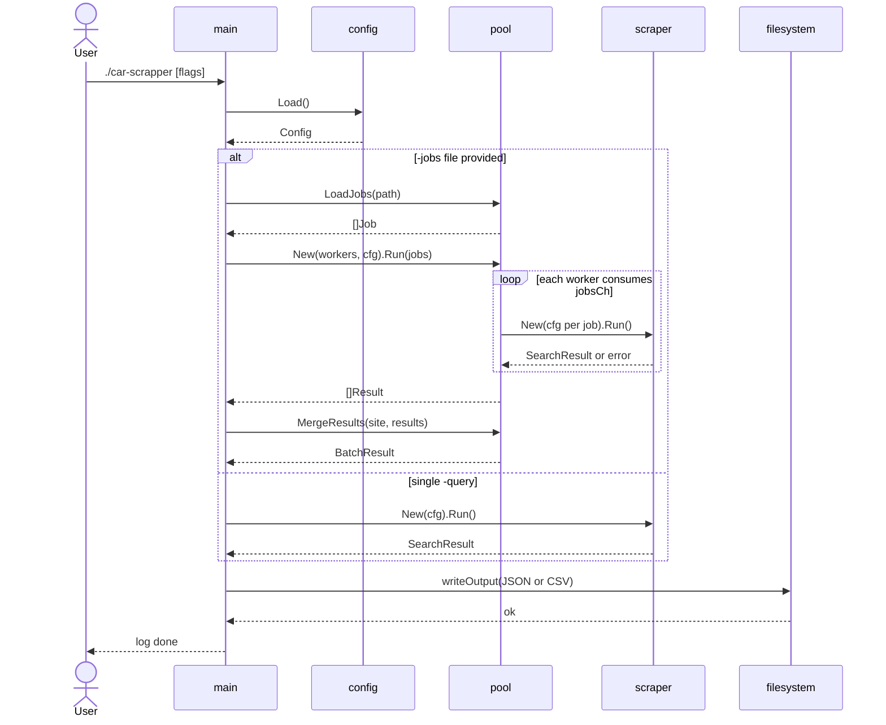
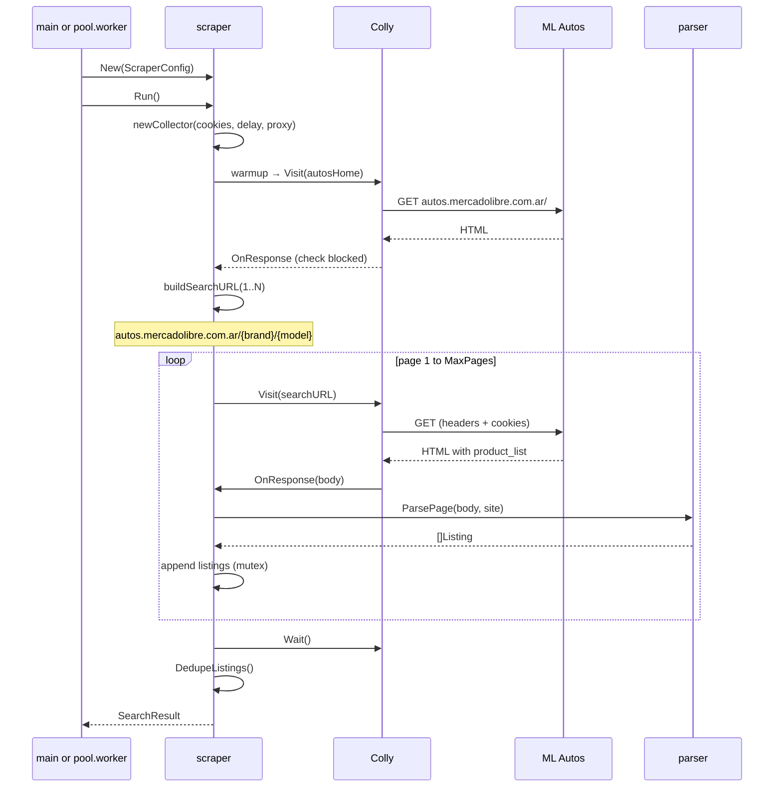
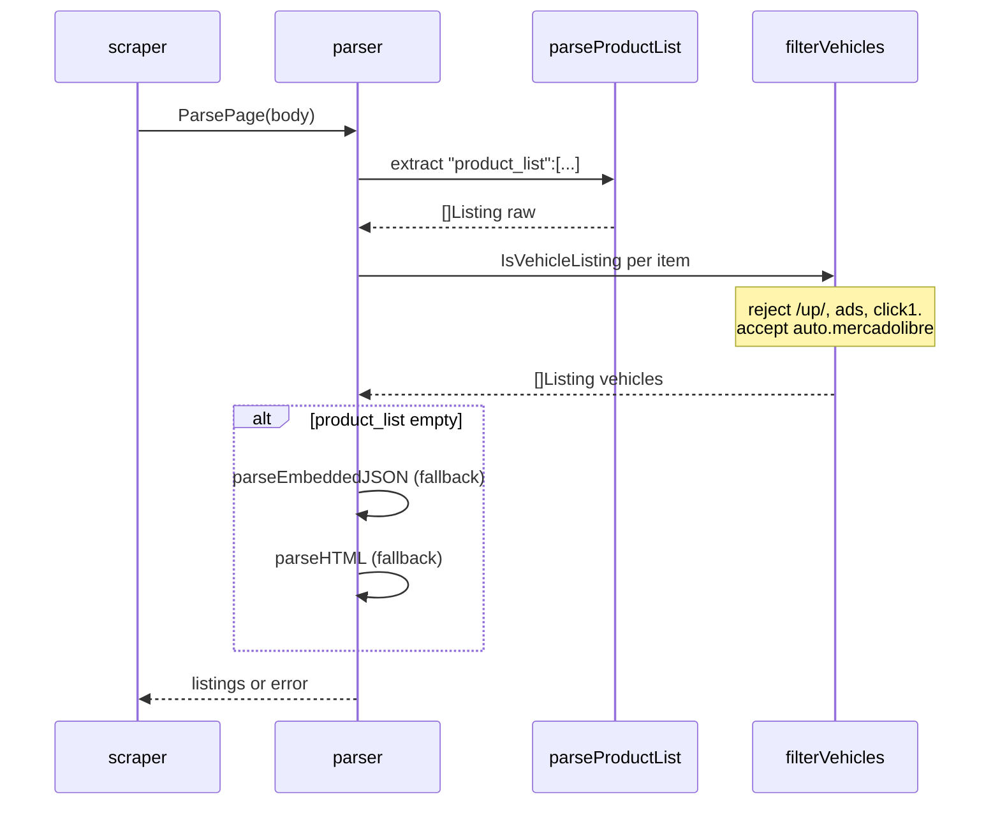
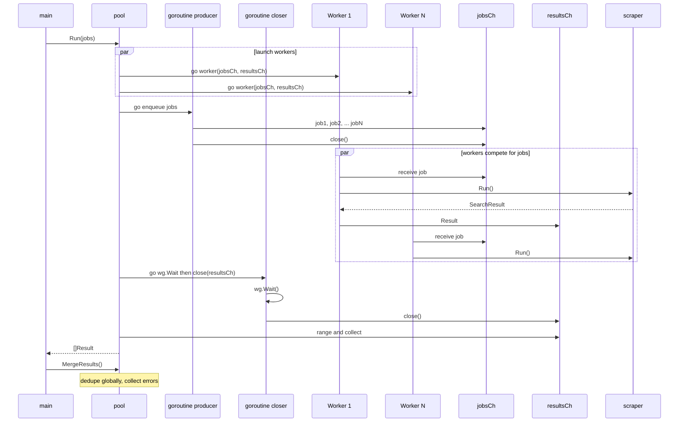

# MercadoLibre Cars Scraper

A Go scraper for MercadoLibre vehicle listings using [Colly](https://github.com/gocolly/colly).

Supports Argentina (MLA), Brazil (MLB), Mexico (MLM), Chile (MLC), Colombia (MCO), and Uruguay (MLU).

## Features

- Scrapes **cars and trucks** from the MercadoLibre autos vertical (`autos.mercadolibre.com.ar`)
- Parses the embedded `product_list` JSON used on autos search pages
- Filters out marketplace parts, accessories, and ads
- Parses title, price, year, kilometers, brand, location, images, and attributes
- Paginates results automatically (48 listings per page)
- Batch mode: scrape multiple brand/model pairs with a worker pool
- Exports to JSON or CSV
- Rate limiting and realistic browser headers

## How search works

Single-query mode splits `-query` into brand and model (first word = brand, rest = model):

```text
-query "toyota corolla"  →  https://autos.mercadolibre.com.ar/toyota/corolla
```

Batch mode (`-jobs`) uses explicit `brand` and `model` fields from a JSON file when building URLs. Each job runs in a worker that calls Colly independently.

Vehicle listings link to `auto.mercadolibre.com.ar/...-_JM`. Results from `www.mercadolibre.com.ar/up/...` (parts catalog) are discarded.

## Requirements

- Go 1.21+
- Browser cookies exported from a logged-in MercadoLibre session

## Install

```bash
go mod download
go build -o car-scrapper ./cmd/car-scrapper
```

## Setup

1. Log in to [mercadolibre.com.ar](https://www.mercadolibre.com.ar) in your browser
2. Export cookies with an extension (e.g. "Get cookies.txt LOCALLY")
3. Save as `cookies.json` in the project root
4. Create `.env`:

```env
ML_COOKIES=cookies.json
```

## Usage

```bash
# All cars on the autos homepage (first page, Argentina)
./car-scrapper

# Search for Toyota Corolla, 3 pages
./car-scrapper -query "toyota corolla" -pages 3

# Scrape multiple models with 3 concurrent workers
./car-scrapper -jobs jobs.example.json -pages 2 -workers 3

# Brazil site, CSV output
./car-scrapper -site MLB -query "fiat argo" -output output/cars.csv

# Slower requests (helps avoid anti-bot blocks)
./car-scrapper -query "ford ranger" -delay 4s -verbose
```

### Flags

| Flag | Default | Description |
|------|---------|-------------|
| `-site` | `MLA` | MercadoLibre site ID |
| `-query` | `""` | Search terms (split into brand/model) |
| `-jobs` | `""` | JSON file with multiple brand/model jobs |
| `-workers` | `3` | Concurrent workers when using `-jobs` |
| `-pages` | `1` | Pages to scrape per job |
| `-delay` | `2s` | Delay between requests |
| `-output` | `output/listings.json` | Output path (`.json` or `.csv`) |
| `-cookies` | `$ML_COOKIES` | Browser cookies file (**required**) |
| `-proxy` | `""` | HTTP proxy URL |
| `-verbose` | `false` | Debug logging |

### Jobs file format

Create a JSON array. Each entry needs a `query` or both `brand` and `model`:

```json
[
  {"brand": "Toyota", "model": "Corolla", "query": "toyota corolla"},
  {"brand": "Ford", "model": "Ranger"}
]
```

See [jobs.example.json](jobs.example.json) for a full example.

## Output

### Single query

```json
{
  "query": "toyota corolla",
  "site": "MLA",
  "total_found": 48,
  "pages_scraped": 1,
  "listings": [
    {
      "id": "MLA1825910161",
      "title": "Toyota Corolla 1.8 Xei Mt 136cv",
      "brand": "Toyota",
      "price": 16000000,
      "currency": "ARS",
      "url": "https://auto.mercadolibre.com.ar/MLA-1825910161-toyota-corolla-18-xei-mt-136cv-_JM",
      "site": "MLA"
    }
  ]
}
```

### Batch (`-jobs`)

```json
{
  "site": "MLA",
  "total_jobs": 5,
  "total_found": 240,
  "listings": [],
  "results_by_query": [
    {
      "query": "toyota corolla",
      "total_found": 48,
      "listings": []
    }
  ],
  "errors": []
}
```

- `listings`: deduplicated vehicles across all jobs
- `results_by_query`: per-job breakdown
- `errors`: jobs that failed without stopping the batch

## Anti-bot block

MercadoLibre redirects unauthenticated automated traffic to a login wall. If blocked:

- Export fresh cookies while logged in
- Increase `-delay` (e.g. `4s`)
- Use `-proxy` with a residential proxy
- Reduce `-workers` in batch mode

## Architecture

Sequence diagrams of the main flows.

### Overview (single vs batch)



### Scrape flow (single mode and each batch job)

Every scrape — whether invoked from `main` or a pool worker — follows this path:



### Parser pipeline



### Worker pool (batch mode)



## Project structure

```
.
├── cmd/car-scrapper/           # CLI entrypoint
├── jobs.example.json           # Sample batch jobs file
├── internal/
│   ├── config/
│   │   ├── config.go           # Flags and scraper settings
│   │   └── env.go              # Environment variable helpers
│   ├── models/listing.go       # Listing, SearchResult, BatchResult
│   ├── parser/
│   │   ├── autos.go            # product_list parser for autos pages
│   │   ├── vehicle.go          # Vehicle vs parts filtering
│   │   └── parser.go           # JSON + HTML fallbacks
│   ├── pool/
│   │   ├── pool.go             # Worker pool (WaitGroup + job queue)
│   │   └── jobs.go             # Jobs file loader
│   └── scraper/
│       ├── scraper.go          # Colly crawler, autos URL builder
│       └── cookies.go          # Cookie file loader
```
